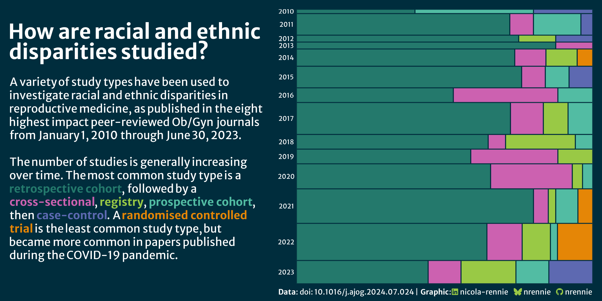
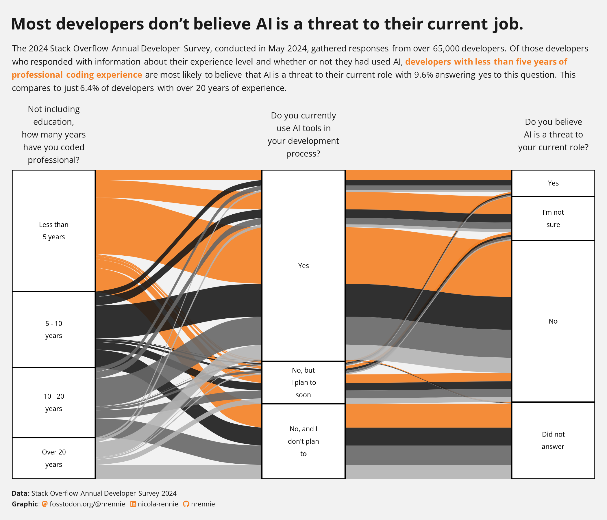
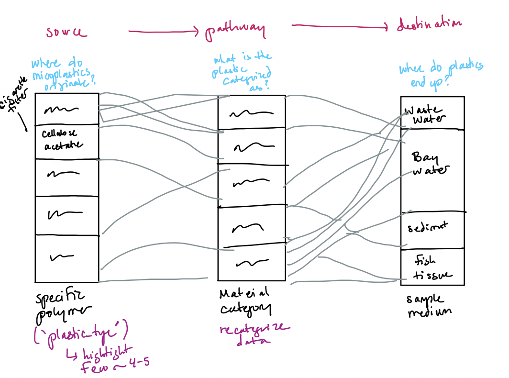
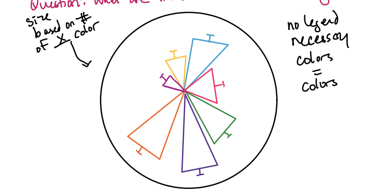
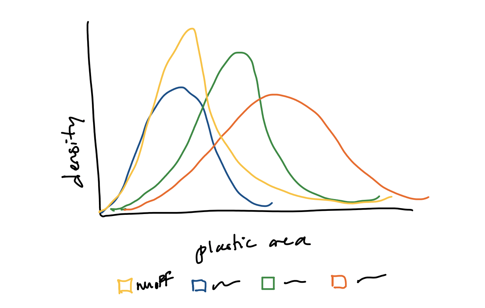
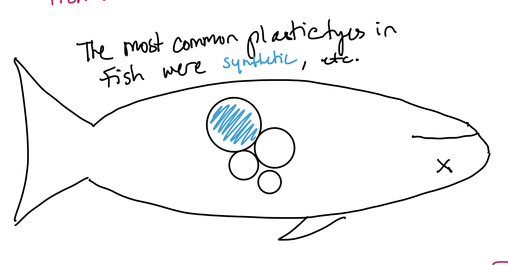

## Objective

**Question 1 and 2**

| Overarching Question | What are the sources and composition of microplastics in the SF Bay Estuary? |
|------------------------------------|------------------------------------|
| **Question** | **Variables Used** |
| What types of plastic dominate in each source? | `Sample_medium` × material type or polymer origin |
| What is the size distribution of particles across sources? | `Sample_medium` × size class or area (mm²) |
| What morphologies are associated with each source? | `Sample_medium` × morphological category |
| Does material type differ between stormwater and wastewater? | Filter `Sample_medium` to runoff vs. effluent, compare material type proportions |
| What are the dominant colors of plastic? | `color`, count the number of color occurrences in the data |

**3. In FPM #2, you created some exploratory data viz to better understand your data. You may already have some ideas of how you plan to formally visualize your data, but it’s incredibly helpful to look at visualizations by other creators for inspiration. Find at least two data visualizations that you could (potentially) borrow / adapt pieces from. Download and embed them into your `drafting-viz.qmd` file, and explain which elements you might borrow (e.g. the graphic form, legend design, layout, etc.).**

 
Elements I plan to use: 
* I like the background color (#002d3d) 
* I like how the text is the legend, this it an intuitive way to understand the graph and can be easy for the general public to interpret. 

 
* I like how the alluvial graph has three distinct sections with questions at each stratum. 
* I plan to use the questions and add another stratum to my alluvial plot.

# 4. Hand drawn visualizations

 



## Visualize 
```{r}
#| label: Set-Up
#| output: false
#| message: false 
#......Set up......

library(tidyverse)
library(tidyr)
library(here)
library(dplyr)
library(ARTofR)
library(janitor)
library(readxl)
library(ggplot2)
library(stringr)
library(ggalluvial)
library(ggforce)
library(ggtext)
library(showtext)
library(glue)
library(packcircles)

#.......Import data......

micro_plastics <- read_excel(here("data/2020-09-11_microparticledata.xlsx")) %>% 
  # Change all columns to lower_snack_case 
  clean_names() 

#.....Clean data with function....
source(here("clean_data_function.R"))

micro_plastics_clean <- clean_microplastics(micro_plastics)

#.......Fonts.......
font_add_google("Hanken Grotesk", "hanken")

#.....Establish palettes.....

#........Enable showtest.....
showtext_auto(enable = TRUE)
```

## Draft viz: alluvial graph

Question: What are the sources of microplastics in sample mediums?

```{r}
#| label: Alluvial graph

large_pal <- c(
  "Plastics"     = "#5ab4e0",  # light blue
  "Textiles"     = "#ff6b6b",  # coral
  "Elastomers"   = "#f9c74f",  # yellow — distinct from coral
  "Other"        = "#b8a9c9",  # lavender
  "Unidentified" = "#6c757d"   # gray
)

alluvial_plot <- micro_plastics_clean %>%
  filter(material_type_refined != "Unidentified plastic") %>% 
  filter(!is.na(material_type_refined), !is.na(sample_medium)) %>%
  count(sample_medium, material_type_refined) %>%
  # Plot 
  ggplot(aes(axis1 = material_type_refined, axis2 = sample_medium, y = n)) +
  geom_alluvium(aes(fill = material_type_refined),
                alpha = 0.8, 
                curve_type = "cubic") +
  scale_fill_manual(values = fish_pal2) +
  geom_stratum(aes(fill = material_type_refined), width = 1/3, color = "#002d3d") +
 geom_text(stat = "stratum", aes(label = after_stat(stratum)),
          family = "hanken", color = "#002d3d", size = 3.5) +
  scale_x_discrete(limits = c("Plastic type", "Sample medium"), expand = c(0.12, 0.1)) +
  labs(x = NULL, y = NULL, fill = "Plastic Type", 
       title = "Sources of Microplastics in the San Francisco Bay Estuary",
       subtitle = "Rigid synthetic polymers dominate microplastic composition across all sampling locations.", 
       caption = "Data: San Francisco Bay Estuary Institute") +
  theme_void() +
  theme(
        legend.position = "bottom",
        legend.title = element_text(color = "white", family = "hanken"),
        legend.text = element_text(color = "white", family = "hanken"),
        plot.title = element_text(color = "white", family = "hanken", 
                              face = "bold", 
                              hjust = 0.5),
        plot.subtitle = element_text(color = "white", family = "hanken", hjust = 0.5, size = 9),
        plot.caption = element_text(color = "white", hjust = 1, family = "hanken"), 
        axis.ticks.y = element_blank(),
        axis.text.y = element_blank(),
        axis.title.x = element_text(color = "white", family = "hanken", size = 4),
        panel.grid.major.y = element_blank(), 
        plot.margin = margin(t= 1, r = 1, b =1, l = 1, "cm"), 
        panel.border = element_blank(),
         panel.background = element_rect(fill = "#002d3d", color = NA),
    plot.background = element_rect(fill = "#002d3d", color = NA)
        ) 
# View plot
alluvial_plot

# Save plot as pdf
ggsave(here("plots", "alluvial.pdf"), alluvial_plot, 
       width = 10, height = 6, 
       device = cairo_pdf)

ggsave(here("plots", "alluvial.png"), alluvial_plot)
  
```

## Question: What are the dominant colors of plastic?

```{r}
#| label: Coord polar graph
#| fig-width: 12
#| fig-height: 8
#....Set-up....
# Make df of plastic counts 
color_counts <- micro_plastics_clean %>%
  filter(!is.na(color)) %>%
  count(color, sort = TRUE)

# Create palette for colors
color_pal <- c(
  "Clear"      = "#daeaf5", "Black"     = "#141414",
  "Blue"       = "#1a5fb4", "White"     = "#f0f0f0",
  "Gray"       = "#8c8c8c", "Light Blue"= "#5ab4e0",
  "Red"        = "#cc2200", "Dark Blue" = "#0d3572",
  "Green"      = "#2d7a3a", "Silver"    = "#bfbfc0",
  "Brown"      = "#6b3a1f", "Yellow"    = "#f5c800",
  "Pink"       = "#e87aa0", "Purple"    = "#6a2db0",
  "Orange"     = "#e06010", "Turquoise" = "#18836e",
  "Gold"       = "#c8980a", "Violet"    = "#7b28c8"
)
# Annotations 
title <- glue::glue("What <span style='color:#cc2200;'>c</span><span style='color:#1a5fb4;'>o</span><span style='color:#2d7a3a;'>l</span><span style='color:#e87aa0;'>o</span><span style='color:#6a2db0;'>r</span><span style='color:#e06010;'>s</span> of microplastics \nare present in the San Francisco Bay Estuary?")

#annotation <- "Black & clear particles\naccounted for 47% of samples."

# Plot 
color_plot <- color_counts %>%
  # Ensure orders remain the same 
  mutate(color = factor(color, levels = color)) %>%  
  ggplot(aes(x = color, y = n, fill = color)) +
  geom_col(width = 1, linewidth = 0.5) +
  scale_fill_manual(values = color_pal) +
  labs(x = NULL, y = NULL, title = title, subtitle = "Black & clear particles accounted for 47% of samples",
       caption = "Data Source: San Francisco Bay\nEstuary Institute (SFEI)") + 
  coord_polar(clip = "off") +
scale_y_continuous(limits = c(-max(color_counts$n) * 0.3, max(color_counts$n) * 1.05)) +
  theme_light() +
  # Circle around the data (acts like a petri dish)
  geom_hline(yintercept = max(color_counts$n) * 1.05,
           color = "white", linewidth = 0.3) +
  theme(legend.position = "none",
        # Title font adjustments 
        plot.title = element_markdown(
          color = "white", 
  family = "hanken", 
  face = "bold", 
  hjust = 0.5, 
  lineheight = 2,
  size = 13,         
  margin = margin(b = 10)
),
        plot.subtitle = element_text(color = "white", family = "hanken", hjust = 0.5, size = 12),
        plot.caption = element_text(color = "white", hjust = 1, family = "hanken", vjust = -5), 
        axis.ticks.y = element_blank(),
        axis.text.y = element_blank(),
        axis.text.x = element_blank(), 
        panel.grid = element_blank(), 
        plot.margin = margin(t = 1, r = 1, b = 2, l = 1, "cm"), 
        panel.border = element_blank(),
        panel.background = element_rect(fill = "#002d3d", color = NA),
        plot.background = element_rect(fill = "#002d3d", color = NA)
        ) 
# View 
color_plot 

# Save plot as pdf
ggsave(here("plots", "color.pdf"), color_plot, 
       width = 10, height = 6, 
       device = cairo_pdf)

# Ideas to improve: 
# Add annotations to show the composition makeup 
# change the colors to show the top 6 colors 
# increase the height to make larger


```

## Size 
```{r}
#| label: density graph
#| warning: false 


times_larger <- micro_plastics_clean %>%
  filter(!is.na(area_mm), is.finite(area_mm)) %>%
  group_by(sample_medium) %>%
  summarise(median_area = median(area_mm)) %>%
  mutate(times_larger = median_area / min(median_area))

#...Set up .....
medium_pal <- c(
  "water"      = "#5ab4e0",  # light blue — keep
  "sediment"   = "#c9a87c",  # tan — keep
  "wastewater" = "#f4a261",  # warm orange
  "fish"       = "#ff6b6b",  # coral — keep
  "runoff"     = "#95d5b2"   # purple
)
medium_pal <- c(
  "Water"      = "#48cae4",  # bright cyan
  "Sediment"   = "#e9c46a",  # warm gold
  "Wastewater" = "#9b72cf",  # muted purple
  "Fish"       = "#f4a261",  # warm orange
  "Runoff"     = "#52b788"   # forest green
)
subtitle <- glue::glue(
  "Microplastic particle sizes for ",
  "<span style='color:#95d5b2;'>wastewater</span>, ",
  "<span style='color:#5ab4e0;'>water</span>, ",
  "<span style='color:#c9a87c;'>sediment</span>, ",
  "<span style='color:#95d5b2;'>runoff</span>, ",
  "and <span style='color:#ff6b6b;'>fish</span> sampling locations.<br>"
)

annotation <- glue::glue(
  "<span style='color:#5ab4e0;'>Water</span> traps plastic particles<br>up to <b>19x larger</b> than fish tissue"
)

annotation2 <- glue::glue("Water traps plastic particles
                         up to 19x larger than fish tissue.")
#....Plot....

density_plot <- micro_plastics_clean %>% 
  # Filter out Nas
filter(!is.na(sample_medium), !is.na(area_mm)) %>%
  group_by(sample_medium) %>%
  # Filter out the outliers (10,000)
  filter(area_mm <= quantile(area_mm, 0.95)) %>%
  ungroup() %>%
  # Plot
  ggplot(aes(x = area_mm, color = sample_medium)) +
  geom_density(alpha = 0.3, linewidth = 0.8) +
  scale_x_log10(labels = scales::label_number(), limits = c(NA, 7)) + #Scale for size data 
  scale_color_manual(values = medium_pal) +
  labs(
    title    = "Where are the largest plastic particles found in the San Francisco Bay?",
    subtitle = subtitle,
    x        = "Plastic particle area (mm²)",
    y        = NULL,
    fill     = "Sample Medium",
    caption = "Data Source: San Francisco Bay Estuary Institute (SFEI)"
  ) +
   annotate(geom = "text", 
           x = 1 , 
           y = 0.80, 
           label = annotation2, 
           family = "hanken", 
           color = "white", 
           size = 4) +
  theme_minimal() +
  theme(
    axis.ticks.y = element_blank(),
    #axis.text.y = element_blank(),
    #axis.title.y = element_text(color = "white", family = "hanken"),
    axis.text.y = element_text(color = "white", family = "hanken"),
    axis.title.x = element_text(color = "white",,family = "hanken",margin = margin(b = 10)),
    axis.text.x = element_text(color ="white", family = "hanken", margin = margin(b = 5)),
    panel.grid.major.y = element_blank(), 
    plot.caption = element_text(color = "white",family = "hanken"),
    plot.title = element_text(color = "white", family = "hanken", face = "bold", hjust = 0.5, margin = margin(b = 10)),
    plot.subtitle = element_markdown(color = "white", family = "hanken", hjust = 0.5, size = 12),
    legend.position = "none", 
    legend.text = element_text(color = "white", family = "hanken"),
    panel.grid = element_blank(),
    panel.background = element_rect(fill = "#002d3d", color = NA),
    plot.background = element_rect(fill = "#002d3d", color = NA)
  )

# View density
density_plot

# Define reference points on your log scale
size_refs <- tibble(
  x     = c(0.01, 0.1, 1, 3.5),
  y     = rep(-0.08, 4),
  size  = c(1, 2, 4, 8),  # manual relative sizing, not actual area values
  #label = c("0.01 mm²", "0.1 mm²", "1 mm²", "3.5 mm²")
)

density_plot +
  geom_point(data = size_refs, aes(x = x, y = y, size = size),
             shape = 21, fill = "white", alpha = 0.7,
             inherit.aes = FALSE) +
  scale_size_area(max_size = 15, guide = "none") +
  coord_cartesian(clip = "off") +
  theme(plot.margin = margin(t = 1, r = 1, b = 2, l = 1, "cm"))  # allows drawing outside plot area
ggsave("density_plot.png", density_plot, 
       width = 10, height = 6, dpi = 300, bg = "#002d3d")

# Change to geom density ridges 
# adjust the sizing 
# remove the y axes
# give more body 

# .....ggridges plot.... 
library(ggridges)

density_ridge_plot <- micro_plastics_clean %>%
  filter(!is.na(material_type_refined), !is.na(area_mm), area_mm > 0) %>%
  group_by(sample_medium) %>%
  filter(material_type_refined != "Unidentified plastic") %>% 
  filter(n() > 30, area_mm <= quantile(area_mm, 0.95)) %>%
  ungroup() %>%
  ggplot(aes(x = log10(area_mm), y = material_type_refined, fill = material_type_refined)) +
  geom_density_ridges2(alpha = 1, color = NA) +
  scale_fill_manual(values = fish_pal2) +
  scale_x_continuous(labels = function(x) scales::label_number()(10^x)) +  # convert log back to readable labels
  labs(
    title    = "Which plastics are the largest?",
    #subtitle = subtitle,
    x        = "Plastic particle area (mm²)",
    y        = NULL,
    caption  = "Data Source: San Francisco Bay Estuary Institute (SFEI)"
  ) +
  theme_minimal(base_size = 14) +
  theme(
    axis.text.y  = element_text(color = "white", family = "hanken", size = ),
    axis.title.x = element_text(color = "white", family = "hanken",margin = margin(t = 15)),
    axis.text.x  = element_text(color = "white", family = "hanken", margin = margin(b = 5)),
    plot.caption = element_text(color = "white", family = "hanken"),
    plot.title   = element_text(color = "white", family = "hanken", face = "bold", hjust = 0.5),
    plot.subtitle = element_markdown(color = "white", family = "hanken", hjust = 0.5),
    legend.position = "none",
    panel.grid = element_blank(),
    panel.background = element_rect(fill = "#002d3d", color = NA),
    plot.background  = element_rect(fill = "#002d3d", color = NA)
    )
density_ridge_plot

# Save ggridge plot 
# Save plot as pdf
ggsave(here("plots", "size.pdf"), density_ridge_plot, 
       width = 10, height = 6, 
       device = cairo_pdf)

ggsave(here("plots", "size.png"), density_ridge_plot)

```


## What combinations of color + morphology are common in each sample medium?
```{r}
micro_plastics_clean %>%
  filter(!is.na(morphological_category)) %>%
  count(sample_medium, morphological_category, color) %>%
  group_by(sample_medium) %>%
  slice_max(n, n = 5)  # top 5 combinations per medium
```

```{r}
total_n_plastics <- micro_plastics_clean %>%
  filter(!is.na(sample_medium)) %>%
  count(sample_medium, sort = TRUE) %>%
  mutate(
    sample_medium = fct_reorder(sample_medium, n)
  ) %>%
  ggplot(aes(x = sample_medium, y = n)) +
  geom_col(fill = "white") +
  geom_text(aes(label = scales::comma(n)), 
            hjust = -0.2, color = "white", 
            family = "hanken", size = 3.5) +
  labs(x = "Sampling environment", 
       y = "Number of microplastics found", 
       title = "What sampling environments had the most microplastics?",
       caption  = "Data Source: San Francisco Bay Estuary Institute (SFEI)") + 
  scale_y_continuous(expand = expansion(mult = c(0, 0.15))) +
  coord_flip() +
  theme_minimal(base_size = 13) +
  theme(
    legend.position = "none",
    axis.title.y = element_text(color = "white", family = "hanken"),
    axis.text.y  = element_text(color = "white", family = "hanken"),
    plot.title = element_text(color = "white", family = "hanken", face = "bold", hjust = 0.5),
    axis.text = element_text(color = "white", family = "hanken"),
    axis.title.x = element_text(color = "white", family = "hanken"),
    plot.caption = element_text(color = "white", family = "hanken"),
    panel.grid = element_blank(),
    panel.background = element_rect(fill = "#002d3d", color = NA),
    plot.background = element_rect(fill = "#002d3d", color = NA)
  )

total_n_plastics

# save as pdf
ggsave(here("plots", "bar_chart.pdf"),total_n_plastics, 
       width = 10, height = 6, 
       device = cairo_pdf)

# save as png

ggsave(here("plots", "bar_chart.png"), total_n_plastics)
```

```{r}
plastic_pal <- c(
  "Polyethylene"  = "#76C8C8",  # light blue
  "Polypropylene" = "#9B2226",  # orange
  "Polystyrene"   = "#76C8C8",  # purple
  "Polyester"     = "#9B2226",  # coral
  "Acrylic"       = "#9B2226"   # yellow
)

top_plastics <- micro_plastics_clean %>%
  filter(!plastic_type %in% c("Not Characterized", "Unknown",
                               "Anthropogenic (unknown base)",
                               "Anthropogenic (cellulosic)",
                               "Unknown Potentially Rubber",
                               "Anthropogenic (synthetic)",
                               "Inorganic natural material",
                               "Stearates, Lubricants, Waxes",
                               "Cotton")) %>%
  count(plastic_type, sort = TRUE) %>%
  head(5) %>%
  mutate(circleProgressiveLayout(n, sizetype = "area"),
         label = paste0(plastic_type))

top_plastics_plot <- ggplot(top_plastics, aes(x0 = x, y0 = y)) +
  geom_circle(aes(r = radius, fill = plastic_type), color = NA) +
  geom_text(aes(x = x, y = y, label = label),
            color = "white", family = "hanken", size = 3.5) +
  coord_equal() +
  scale_fill_manual(values = plastic_pal) +
  theme_void() +
  theme(
    legend.position = "none",
    panel.grid.major = element_blank(),
    plot.background = element_rect(fill = "#002d3d", color = NA),
    panel.background = element_rect(fill = "#002d3d", color = NA)
  )
top_plastics_plot
# Save plot as pdf
ggsave(here("plots", "top_plastics_plot.pdf"), top_plastics_plot, 
       width = 10, height = 6, 
       device = cairo_pdf)

# save as png
ggsave(here("plots", "top_plastics_plot.png"), top_plastics_plot) 

```


## Question: What types of plastic end up in fish tissue?

```{r}
#| label: Bubble graph
#| fig-width: 10


fish_pal2 <- c(
  "Other" = "#168aad",  # deep teal
  "Common Synthetic Plastics"                = "#76c8c8",  # soft cyan
  "Industrial & Specialty Polymers"          = "#f4a261",  # warm orange
  "Natural Materials"                        = "#99c1a9",  # muted sage
  "Rubber"                                   = "#e9c46a",  # warm gold
  "Synthetic Fibers & Textiles"              = "#9B2226",  # dark red
  "Unidentified plastic"                     = "#6c757d"   # gray
)

# Annotations
subtitle_fish <- glue::glue(
  "<span style='color:#adb5bd;'>Unknown plastic</span> and ",
  "<span style='color:#52b69a;'>synthetic fibers</span> found in fish tissue in high amounts"
)
annotation <- glue::glue()


fish_bubble_plot <- micro_plastics_clean %>%
  # Filter for only tissue data 
  filter(sample_medium == c("fish")) %>%
  filter(!is.na(material_type_refined)) %>%
  count(material_type_refined) %>%
  mutate(circleProgressiveLayout(n, sizetype = "area")) %>%
  # Plot 
  ggplot(aes(x0 = x, y0 = y)) +
  geom_circle(aes(r = radius, fill = material_type_refined), color = NA) +
  labs(fill = "Plastic Type",
       title = "We still do not know what plastic ends up in fish",
       subtitle = subtitle_fish, 
       caption = "Data Source: San Francisco Bay Estuary Institute (SFEI)") +
  scale_fill_manual(values = bubble_pal2) +
  coord_equal() +
  theme_void() 
  theme(plot.title = element_text(color = "white", family = "hanken", face = "bold", hjust = 0.5, margin = margin(b = 5)),
        plot.subtitle = element_markdown(color = "white", family = "hanken", hjust = 0.5, size = 9),
        plot.caption = element_text(color = "white", hjust = 1, family = "hanken"), 
        legend.text = element_text(color = "white", family = "hanken"),
        axis.ticks.y = element_blank(),
        axis.text.y = element_blank(),
        legend.title = element_text(color = "white", family = "hanken"),
        axis.text.x = element_blank(), 
        panel.grid = element_blank(), 
        plot.margin = margin(t = 1, r = 1, b = 2, l = 0.5, "cm"), 
        panel.border = element_blank(),
        panel.background = element_rect(fill = "#002d3d", color = NA),
        plot.background = element_rect(fill = "#002d3d", color = NA)
  )

# View plot
fish_bubble_plot

# Save plot 

fish_pct_plot <- micro_plastics_clean %>%
  filter(sample_medium == "Fish", !is.na(material_type_refined),
         material_type_refined != "Unidentified plastic") %>%
  count(material_type_refined) %>%
mutate(pct = n / sum(n) * 100,
       material_type_refined = fct_reorder(material_type_refined, pct)) %>% 
  ggplot(aes(x = 1, y = pct, fill = material_type_refined)) +
  geom_col() +
  geom_text(aes(label = paste0(round(pct, 0), "%")),
            position = position_stack(vjust = 0.5),
            color = "white", family = "hanken", size = 3.5) +
  scale_fill_manual(values = fish_pal2) +
  coord_flip() +
  labs(x = NULL, y = "Percentage (%)",
       title = "Types of plastic found in fish tissue",
       fill = "Plastic Type",
       caption = "Data Source: San Francisco Bay Estuary Institute (SFEI)") +
  theme_minimal() +
  theme(
    axis.text.y = element_blank(),
    axis.ticks.y = element_blank(),
    plot.title = element_text(color = "white", family = "hanken", face = "bold", hjust = 0.5),
    axis.text.x = element_text(color = "white", family = "hanken"),
    axis.title.x = element_text(color = "white", family = "hanken"),
    legend.text = element_text(color = "white", family = "hanken"),
    legend.title = element_text(color = "white", family = "hanken"), 
    panel.grid = element_blank(),
    plot.caption = element_text(color = "white", family = "hanken"),
    panel.background = element_rect(fill = "#002d3d", color = NA),
    plot.background = element_rect(fill = "#002d3d", color = NA)
  )

fish_pct_plot

ggsave(here("plots", "fish_pct_plot.pdf"), fish_pct_plot, 
       width = 10, height = 6, 
       device = cairo_pdf)

ggsave(here("plots", "fish_pct_plot.png"), fish_pct_plot)
```

```{r}
micro_plastics_clean %>%
  filter(!plastic_type %in% c("Not Characterized", "Unknown",
                               "Anthropogenic (unknown base)",
                               "Anthropogenic (cellulosic)",
                               "Unknown Potentially Rubber",
                               "Anthropogenic (synthetic)")) %>%
  count(material_type_refined, plastic_type, sort = TRUE) %>%
  group_by(material_type_refined) %>%
  slice_max(n, n = 3)
```

```{r}

```


```{r}
# Turn off showtext
showtext_auto(enable = FALSE)
```

## Questions:

**1. What are the key insights you want your infographic to communicate, and how will your design choices help highlight and support those messages?** I want my infographic to take the findings of SFEI and make them digestible to the public. I want my infographic to be informative with intuitive categories and relevant highlights of key data trends. I chose to have one-two fairly *complex* plots, such as the alluvial graph and density plot, to convey information and some plots with easier interpretation such as the bubble plot.

**2. What challenges did you encounter or anticipate encountering as you continue to build / iterate on your visualizations in R? If you struggled with mocking up any of your three visualizations, describe those challenges here.** I struggle to determine intuitive categories for my `plastic_type` column as well as ways to convey `sample_medium` in a way anyone would understand. I also noticed that after plotting the bubble chart, the sizing makes it hard to see the difference between textile and synthetics so I decided to highlight both as plastic types found in fish.

**3. What ggplot extension tools / packages do you need to use to build your visualizations? Are there any that we haven’t covered in class that you’ll be learning how to use for your visualizations?** The ggplot extensions that I have used are `ggalluvial` and `packcircles`.

**4. What feedback do you need from the instructional team and / or your peers to ensure that your intended message and key insights are clear?** I need assistance on re categorizing the data. I have some ideas I plan to implement, however I need to test with people about which categories make the most sense as people with little knowledge of micro plastic terminology.
